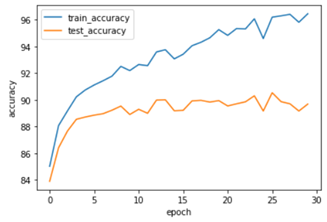
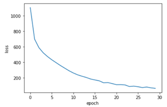

# AI - Classification

## Setup requirements:
```python
Python 3.9.7
PyTorch 1.10.1+cu113
Numpy 1.20.3
Matplotlib 3.5.1
```
## To run the code:
1. Go to file directory
```
cd AI_classification
```
2. Run code in terminal
```
python AI_classification.py
```

## Task Description:
You are an artist who secluded yourself for years to come up with the perfect design for a new brand of clothes. However, your time off from civilisation was not so beneficial since you cannot distinguish a T-shirt from a dress or a sneaker from a sandal any more. In order to address that issue, you choose to train a Convolutional Neural Network (using PyTorch) that will help you identify each cloth to match the perfect design you created. In order to train it, you decide to rely on the dataset fashion MNIST (https://github.com/zalandoresearch/fashion-mnist).

The code contains the creation and training of a Convolutional Neural Network corresponding to the following architecture:
1. Input image size: 28 × 28 × 1 (height × width × number of channels).
2. First convolutional layer: Kernel size (5 × 5), Stride size (1 × 1) and 32 output channels.
Activation function.
3. Max pooling layer: Kernel size (2 × 2) and Stride size (2 × 2).
4. Second convolutional layer: Kernel size (5×5), Stride size (1 × 1) and 64 output channels.
Activation function.
5. Max pooling layer: Kernel size (2 × 2) and Stride size (2 × 2).
6. First fully-connected layer with input size being the output size of max pooling layer in 5. (flattened, i.e. 1024) and output size 1024. Activation function.
7. Second fully-connected layer with input size being the output size of fully connected layer in 6. (i.e. 1024) and output size 256. Activation function.
8. Output layer with input size being the output size of fully-connected layer in 7. (i.e. 256) and output size 10.

For training, weights is initialized using Xavier Uniform initialisation, and experiment on different activation function (ReLU, Tanh, Sigmoid, ELU), with different learning rate (0.001, 0.1, 0.5, 1, 10) with the SGD optimiser.

Dropout rate of 0.3 is added on the second fully connected layer afterwards. 
This prevents overfitting, such that it makes the raining process noisy and causes network to rely only on partial information. Classification will have better test accuracy than original function without dropout.

For this assignment, cross-entropy loss function is used for classification tasks, which uses negative log-likelihood.
The formula is $H(P, Q)=-\sum_{x \in X} P(x) \log Q(x)$ where Q is the predicted distribution and P is the true distribution.
The probability is modelled by using P and the encoding size using Q.

## Plots (ReLU):
Accurary on training and test sets per each epoch



Train loss per epoch



