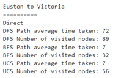
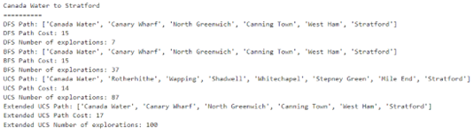
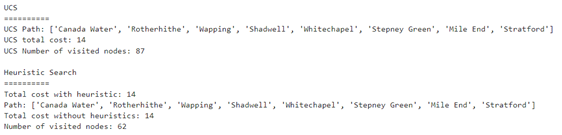

# AI - Search algorithms

## Setup Requirements:
```python
Python 3.9.7
Numpy 1.20.3
Pandas 1.3.5
Networkx 2.6.3
Matplotlib 3.5.1
```
## To run the code:
1. Go to file directory
```
cd AI_search
```
2. Run code in terminal
```
python AI_searchalg.py
```


## Task Description:
Your task is to build an AI route finder using agenda-based search mechanism. You are given a data file (tubedata.csv) in CSV format with the London Tube map (which is not necessarily to be up-todate and complete). The Tube map is defined in terms of a logical relation Tube “step”. If you open the data file with any text editor, you will see the content of the file as:

Harrow & Wealdstone, Kenton, Bakerloo, 3, 5, 0
Kenton, South Kenton, Bakerloo, 2, 4, 0

· · ·

Bank/Monument, Waterloo, Waterloo & City, 4, 1, 0

Each row in the CSV file represents a Tube “step” and is in the following format:
[StartingStation], [EndingStation], [TubeLine], [AverageTimeTaken], [MainZone], [SecondaryZone]
where:
- StartingStation: a starting station
- EndingStation: a directly connected ending station
- TubeLine: the tube line connecting the stations above
- AverageTimeTaken: the average time, in minutes, taken between the starting and the ending
station
- MainZone: the main zone of the starting station
- SecondaryZone: the secondary zone of the starting station, which is 0 if the station is only in one zone. Note: to define the zone for the ending station use the main zone if the secondary zone is 0 otherwise use the secondary zone.

Throughout this assignment, you may find it helpful to refer to the London Tube map at https://content.tfl.gov.uk/large-print-tube-map.pdf

1. Three search methods are used to make comparison: DFS (Depth First Search), BFS (Breadth-First Search), UCS (Uniform-Cost Search)

2. UCS cost function is improved by including time to change lines at one station (e.g., 2 minutes)

3. Heuristic search

## Results:
DFS, BFS, UCS (Euston to Victoria)



Extended UCS cost function (Canada Water to Stratford)



Comparison between UCS and Heuristic Search (Canada Water to Stratford)

