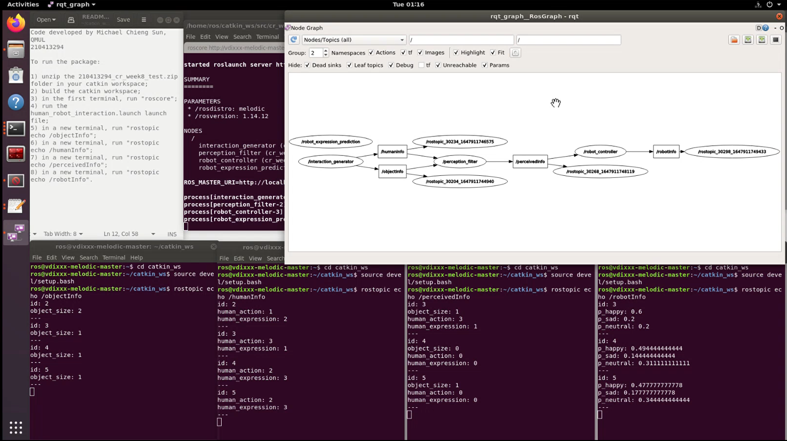

# Cognitive robot - ROS

## Setup Requirements:
- Install ROS melodic
http://wiki.ros.org/melodic/Installation
- Download the folder `cr_week8_test` to your catkin workspace

## To run the code:
1. Build the catkin workspace.
2. In the first terminal, run "roscore".
3. In the second terminal, run "rqt_plot rqt_plot" to create rqt_plot GUI.
4. Insert the three topic "/position_trajectory", "/velocity_trajectory", "/acceleration_trajectory" into the rqt_plot GUI.
5. In the third terminal, go into your catkin workspace, source your environment setup, and run "rosrun rqt_graph rqt_graph" to create rqt_graph GUI.
6. In the fourth terminal, go into the launch directory of your catkin workspace and run the cubic_traj_gen.launch launch file by typing "roslaunch ar_week5_test cubic_traj_gen.launch".

## Task Description:
Create a ROS package that simulates a simple computational model of social human-robot interaction.

Scenario:
Consider a social humanoid robot sitting at a table in front of a human child. At each interaction, a different colored toy is placed on the table, and the robot should express one emotion, which depends on both the perceived object properties and the perceived child behavior. This can be modeled with a Bayesian Network.
The robot can perceive the size of the object (O), and classify it as either: small, big (they are all equally likely to happen). The robot can perceive human facial expressions (HE), and classify them as either: happy, sad, neutral (they are all equally likely to happen). The robot can perceive human head and eyes movements (actions, HA), and classify them as either: looking at the robot face, looking at the colored toy, looking away (they are all equally likely to happen). The robot face can express three possible emotions (RE): happy, sad, neutral. Note that, during an interaction, the robot might not have
access to all the variables (object size, human expression, human action), due to e.g.
absence of one of the stimuli or failure of a sensor, but still the robot has to decide what
emotion expression is the most likely to be appropriate.

## Result:
